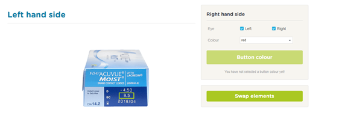
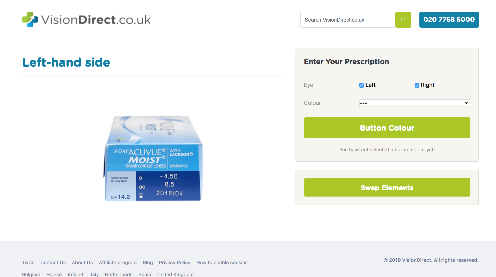
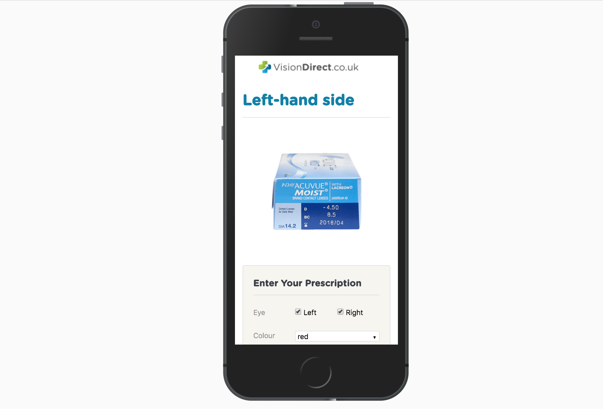

# vd-techtest
Tech Test  

## Instructions  

Please produce a layout that has 2 columns a left hand side column and a right hand side column. The Left hand side will contain an image but the right hand side contains check boxes, a drop down and 2 buttons.  

In the drop down list, there are 3 options: red, blue and green. When a user selects a colour, the 'Button colour' button changes to that selected colour. When the user clicks on the 'Swap elements' button, the 2 columns are swapped.   

## Bonus points  

The widget is set up on a page with a head/ footer elements, browser compatible (min IE 10...) and is responsive.  

## My code  

1. head/ footer elements: simplified versions of the actual VD website head/ footer; responsive.

2. IE10:  
<code>pointer-events: none;</code> is not IE10 compatible and thus added jQ code to script.js  

3. responsive: website uses Twitter Bootstrap

Desktop  
  

Mobile  
  
